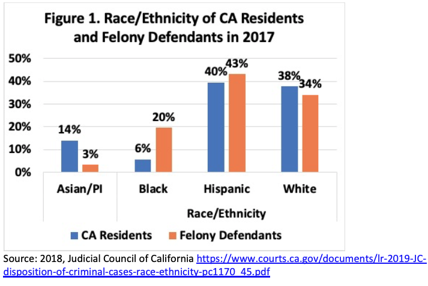

# econometric_analysis_crime_free_multihousing_program_in_california
This is a panel data fixed effects regression econometric analysis and policy analysis Capstone using Stata (similar to R) and excel. Data visualizations were created with both Stata and excel as well.

## Executive Summary

Crime Free Multi-housing programs are the Crime Prevention Through Environmental Design programs that city and county police departments teach and certify landlords, so they then enforce standards of criminality, like not having arrests or criminal records, on tenants at their rental properties. Consequences for tenants tend to be evictions and consequences for property owners for not enforcing the program are being sued or fined by the local government and courts. Sometimes municipalities just have the programs which tend to be similar and in other cases the programs are further enforced by Crime Free Rental Housing Ordinances that enforce participation of all rental properties in the municipality.
The concern for crime free housing laws are their impacts on housing insecurity for Black and Latino residents and residents of lower income who are disproportionately impacted by nuisance and crime free laws because of the higher rates incarceration and poverty among Black and Latinos (Pettit & Gutierrez, 2018, Gradín, 2012) and the racially motivated use of “nuisance” that historically excluded people of color from space (Henderson, 2019). It applies especially for the accessibility of public housing for low-income families (Krueger, 2010). These laws even encourage the type of short leases that allow property managers to quickly get rid of tenants by not renewing their leases (Krueger, 2010). This study used Uniform Crime Reporting (UCR) panel data for California Counties between the years 1991 to 2018 to conduct and panel data fixed effect analysis to determining if Crime Free Multi-Housing (CFMH) programs were associated with a reduction in crime as had been cited in service call data released by police departments using within subject analysis. With a panel data fixed effects regression analysis, this study found that the CFMH program was associated with a statistically significant decrease in reported property and violent crime at the 5% level.

Considering the public support and supportive data for these programs, it is recommended that policymakers keep these programs while adjusting them to account for potential Fair Housing Act violations and adding term limits or limiting the type of crimes it can be used to enforce against so that some of the housing disparity that it causes is addressed.

## Data Cleaning and Data Visualization using excel
In excel, I cut extraneous variables and combined like data by years. I also created a Year variable. I also created a graphic for Race in California to better visualize the race demographics in my study. Lastly, I exported my data to STATA to convert into a dta file.

## Econometric Analysis using Stata
### Setting up data

Open .dta file to use for analysis
`use"/Users/alexbaker/Documents/Pepperdine/Capstone/AlexCapstonev1.dta"
`
Because of the skew of crime data, use the log of the crime variables to try to correct the skew
`generate lnproperty = ln(PropertyRate)
generate lnviolent = ln(ViolentRate)
generate single = SingleFamily/TotHousing
generate multi = MultiFamily/TotHousing
generate mobile = MobileHomes/TotHousing`

Label variables for clarity
`label variable PropertyRate "Property Crime rate per County 1997-2018"
label variable ViolentRate "Violent Crime rate per County 1997-2019"
label variable lnproperty "Log of Proportion of Property Crimes per County 1997-2018"
label variable lnviolent "Log of Proportion of Violent Crimes per County 1997-2018"
label variable Hispanic "Proportion of Hispanic Ethnicity per County 1997-2018"
label variable AsianPI "Proportion of Asian and Pacific Islander Race per County 1997-2018"
label variable White "Proportion White Race per County 1997-2018"
label variable Black "Proportion Black/African American Race per County 1997-2018"
label variable SingleFamily "Single Family Homes per County 1997-2018"
label variable MultiFamily "Multi-Family Homes per County 1997-2018"
label variable MobileHomes "Mobile Homes per County 1997-2018"
label variable FIPScounty "FIPS county codes"
label variable CrimeFree "Crime-Free Multihousing program"
label variable AreaName "County names"
label variable single "Proportion of Single Family Homes per County 1997-2018"
label variable multi "Proportion of Multi-Family Homes per County 1997-2018"
label variable mobile "Proportion of Mobile Homes per County 1997-2018"
label variable TotHousing "Total of housing types"
label variable PovEstAge017 "Poverty Estimate Ages 0-17"
label variable PovEstAge517 "Poverty Estimate Ages 5-17"
label variable PovEstAllAges "Poverty Estimate All Ages"
label variable PovPerAge017 "Poverty Percentage Ages 0-17"
label variable PovPerAge517 "Poverty Percentage Ages 5-17"
label variable PovPerAllAges "Poverty Percentage All Ages"
label variable MedianHouseholdIncome "Median Household Income"`

### Data Description
Use summarize to see descriptive statistics
`summarize Year FIPScounty CrimeFree PropertyRate ViolentRate AsianPI Black Hispanic White single multi mobile PovPerAge017 PovPerAge517 PovPerAllAges MedianHouseholdIncome
su Year FIPScounty CrimeFree PropertyRate ViolentRate AsianPI Black Hispanic White PovPerAge017 PovPerAge517 PovPerAllAges MedianHouseholdIncome, det
describe Year FIPScounty CrimeFree PropertyRate ViolentRate AsianPI Black Hispanic White PovPerAge017 PovPerAge517 PovPerAllAges MedianHouseholdIncome`

Create kdensity graphs to see the skew of data. Can also create scatterplots and correlations to compare the relationships of data.
`kdensity PropertyRate
kdensity ViolentRate
kdensity lnviolent
kdensity lnproperty
correlate lnviolent lnproperty CrimeFree single multi mobile Year White Hispanic Black AsianPI  PovPerAge017 PovPerAge517 PovPerAllAges MedianHouseholdIncome
pwcorr lnviolent lnproperty CrimeFree, star(0.05) sig`

`pwcorr lnviolent lnproperty CrimeFree single multi mobile Year White Hispanic Black AsianPI  PovPerAge017 
PovPerAge517 PovPerAllAges MedianHouseholdIncome, star(0.05) sig`

`graph twoway scatter lnviolent lnproperty, msize(small)`

`graph twoway scatter lnproperty Year, msize(small)`

`graph twoway scatter lnviolent  Year, msize(small)`

### Property Crime Regressions
Conduct simple regressions just using the independent and dependent variables first to see what the relationship is like including the p-value, r-squared, and standard errors. See how it changes when control variables are added. Use ", r" so that that standard errors are robust. Use outreg to save regression output as a table.
`regress lnproperty CrimeFree, r
outreg, ctitle("Property Crime 1997-2018",OLS 1) summtitle("SER"\"R^2"\"Adjusted R^2"\"N") se
regress lnproperty CrimeFree Black White AsianPI Hispanic single multi MedianHouseholdIncome PovPerAge017 PovPerAllAges, r
outreg , ctitle("Property Crime 1997-2018",OLS 2) summtitle("SER"\"R^2"\"Adjusted R^2"\"N") se merge
`
Use xtset to declare it panel data. FIPScounty is the ID and Year is the time vairable. Use ", fe" for fixed effects. Similarly here, you can regress with just the independent and dependent variables and also add in the control variables. Ultimately, the regression that we care about most is the last one which is the pandel data fixed effects with control variables.
`xtset FIPScounty Year
xtreg lnproperty CrimeFree, fe
outreg , ctitle("Property Crime 1997-2018",FE 1) summtitle("SER"\"R^2"\"Adjusted R^2"\"N") se merge
xtreg lnproperty CrimeFree Black White AsianPI Hispanic single multi MedianHouseholdIncome PovPerAge017 PovPerAllAges, fe 
outreg , ctitle("Property Crime 1997-2018",FE 2) summtitle("SER"\"R^2"\"Adjusted R^2"\"N") se merge `

	
### Violent Crime
Repeat the same process as was used for property crime since this is a separate dependent variable.
`regress lnviolent CrimeFree, r
outreg, ctitle("Violent Crime 1997-2018",OLS 1) summtitle("SER"\"R^2"\"Adjusted R^2"\"N") se
regress lnviolent CrimeFree Black White AsianPI Hispanic single multi MedianHouseholdIncome PovPerAge017 PovPerAllAges, r
outreg , ctitle("Violent Crime 1997-2018",OLS 2) summtitle("SER"\"R^2"\"Adjusted R^2"\"N") se merge
xtset FIPScounty Year
xtreg lnviolent CrimeFree, fe
outreg , ctitle("Violent Crime 1997-2018",FE 1) summtitle("SER"\"R^2"\"Adjusted R^2"\"N") se merge
xtreg lnviolent CrimeFree Black White AsianPI Hispanic single multi MedianHouseholdIncome PovPerAge017 PovPerAllAges, fe
outreg , ctitle("Violent Crime 1997-2018",FE 2) summtitle("SER"\"R^2"\"Adjusted R^2"\"N") se merge `

Combined Crime

`regress lnproperty CrimeFree Black White AsianPI Hispanic single multi MedianHouseholdIncome PovPerAge017 PovPerAllAges, r
outreg , ctitle("Crime 1997-2018",OLS P) summtitle("SER"\"R^2"\"Adjusted R^2"\"N") se
regress lnviolent CrimeFree Black White AsianPI Hispanic single multi MedianHouseholdIncome PovPerAge017 PovPerAllAges, r
outreg , ctitle("Crime 1997-2018",OLS V) summtitle("SER"\"R^2"\"Adjusted R^2"\"N") se merge 
xtset FIPScounty Year
xtreg lnproperty CrimeFree Black White AsianPI Hispanic single multi MedianHouseholdIncome PovPerAge017 PovPerAllAges, fe 
outreg , ctitle("Crime 1997-2018",FE P) summtitle("SER"\"R^2"\"Adjusted R^2"\"N") se merge 
xtreg lnviolent CrimeFree Black White AsianPI Hispanic single multi MedianHouseholdIncome PovPerAge017 PovPerAllAges, fe
outreg , ctitle("Crime 1997-2018",FE V) summtitle("SER"\"R^2"\"Adjusted R^2"\"N") se merge 
`